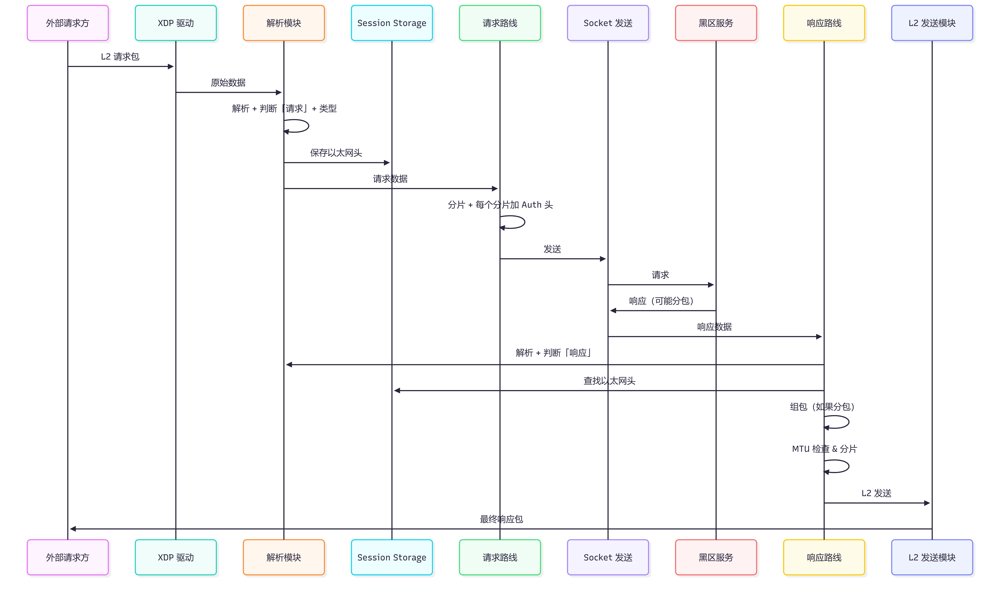
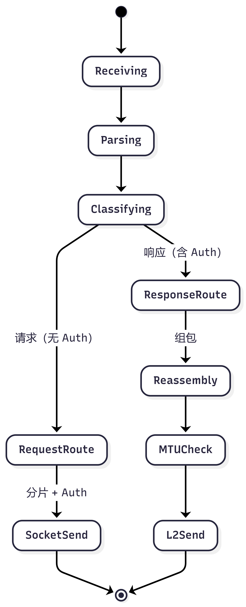

# XDP 数据路径处理架构设计

## 一、需求描述

1. 接收 XDP 返回的原始数据。  
2. 开始解析原始数据，保存以太包各种头数据和数据载荷，然后根据源端口和是否包含 Auth 头判断是否是黑区响应消息，如果是再根据消息类型和载荷包含的端口信息判断是哪一类响应消息，否则就是请求消息，然后根据源端口判断是哪种类型的请求。  
3. 根据第二条的数据如果走**请求路线**：保存源和目标以太网包头信息，如果根据需求判断数据需要分片，先分片然后**每一个分片载荷加上 Auth 头**再发送给黑区。  
4. 根据第二条获取的数据，如果是**黑区响应数据**：开始解析数据，查找请求时保存的以太网包头，然后**二层发送**数据给请求方。这里需要注意如果黑区响应做了分包，则需要组包，当判断包已经组装完成后再发送给请求方。由于是二层发送，如果组装后的数据包大于系统的 MTU，需要做分包处理。

**核心原则**：所有数据统一从 XDP 接收 → 解析后分支两条路线  
- 请求路线 → Socket 发送（每个分片带 Auth 头）  
- 响应路线 → 二层 L2 发送（组包 + MTU 处理）

---

## 二、架构流程图


**图中包含内容**：  
- XDP 统一接收入口  
- 解析、判断包类型（请求/响应）  
- 请求路线：保存以太网头 → 分片 + Auth 头 → Socket 发送  
- 响应路线：查找以太网头 → 组包 → MTU 判断 → L2 发送  
- Session Storage 与 Fragment Buffer 等数据结构  
- 简易状态机流转

---

## 三、时序图（请求-响应完整一轮）



**时序图说明**：  
清晰展示一次完整交互：  
外部请求方 → XDP → 解析 → 请求路线（Socket + Auth）→ 黑区 → 响应路线（组包 + L2 发送）→ 返回给请求方。

---

## 四、核心模块说明

- **[模块] XDP 数据接收**：所有流量统一入口  
- **[过程] 解析原始数据**：保存以太网头、Payload、提取源端口  
- **[决策] 判断包类型**：依据 Auth 头 + 源端口区分请求/响应  
- **[模块] 请求路线**：保存头信息、分片 + 追加 Auth 头、Socket 发送  
- **[模块] 响应路线**：查找保存的以太网头、组包、MTU 分片、二层 L2 发送  

## 五、数据结构

- **Session Storage**：`hash<session_key, Ethernet Header>`（保存源/目标 MAC、IP、端口等）  
- **Fragment Buffer**：`pool`（用于响应组包）  
- **Auth Header**：请求分片时追加的认证结构（Magic、Version、Session ID 等）
## Auth 头结构体示意图

```text
+================================================================================+
|                              Auth Header          (12 bytes)                   |
|                              Ethernet Header      (14 bytes)                   |
|                              IPv4 Header          (20 bytes)                   |
|                              UDP Header           (8 bytes)                    |
|                              Inner Payload        (Variable Length)            |
+================================================================================+
```
<!-- ## 六、处理状态机（简版） -->
<!--  -->

## 六、处理状态机（简版）

```text
                                   +-------------+
                                   |    [*]      |   ← 开始
                                   +-------------+
                                          |
                                          v
                                   +-------------+
                                   |  Receiving  |   ← XDP 接收原始数据
                                   +-------------+
                                          |
                                          v
                                   +-------------+
                                   |   Parsing   |   ← 解析以太网头 + Payload
                                   +-------------+
                                          |
                                          v
                                   +-------------+
                                   | Classifying |   ← 判断包类型
                                   +-------------+
                                    /           \
                                   /             \
                                  /               \
                                 v                 v
                    +----------------+     +----------------+
                    |  RequestRoute  |     | ResponseRoute  |
                    | (请求 · 无Auth)|     | (响应 · 含Auth) |
                    +----------------+     +----------------+
                           |                        |
                           v                        v
                    +----------------+     +----------------+
                    |   SocketSend   |     |   Reassembly   |
                    | (分片 + Auth)  |     |     (组包)      |
                    +----------------+     +----------------+
                           |                        |
                           |                        v
                           |                 +-------------+
                           |                 |  MTUCheck   |   ← MTU 检查
                           |                 +-------------+
                           |                        |
                           |                        v
                           |                 +-------------+
                           |                 |   L2Send    |   ← 二层发送
                           |                 +-------------+
                           |                        |
                           +------------------------+
                                          |
                                          v
                                   +-------------+
                                   |    [*]      |   ← 结束
                                   +-------------+